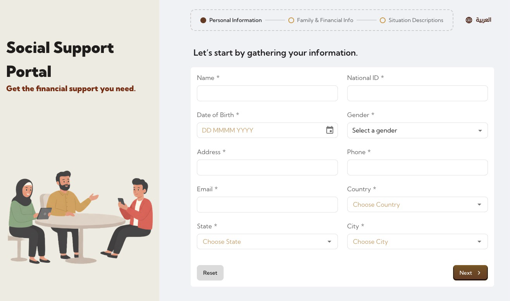
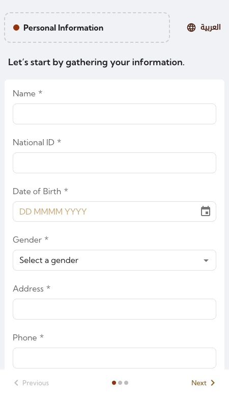
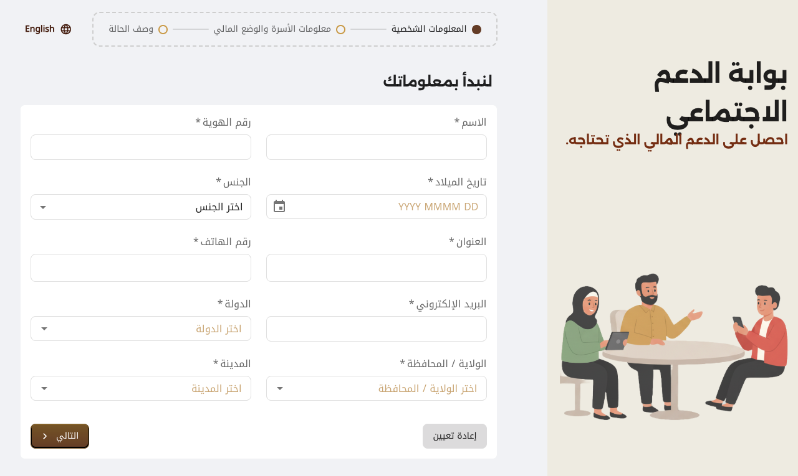
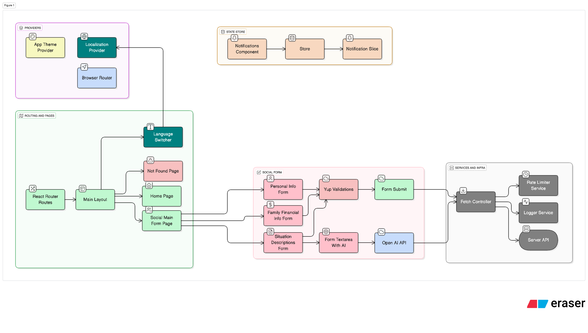

# Social Support Application with AI Assistance

A responsive website with Arabic(RTL) support, and integrated OpenAI api.

A fullstack monorepo containing:

- client: React + Vite app
- server: Express API with OpenAI integration

## Tech Stack

- Framework: React 19
- UI Library: Material UI & Tailwind CSS
- Form Handling: react-hook-form
- State Management: Context API & Redux Toolkit
- API Calls: Axios
- Internationalization: React-i18next
- Routing: React Router
- Testing: vitest(Jest) & Testing Library

## Screenshots





## Prerequisites

- Node.js >= 24 (required by server)
  - Check: `node -v`
- Yarn (Classic v1 recommended)
  - Install (if needed): `npm i -g yarn`
- OpenAI API key (for AI-assisted features)

## Quick Start

1. Install dependencies (from repo root)

```
yarn install
```

2. Configure environment variables

- Client
  - Copy: `cp client/.env.example client/.env`
  - Variables:
    - `CLIENT_PORT` (optional) — Vite dev server port (example uses 3001; Vite default is 5173 if not set)
    - `SERVER_URL` — URL where the API server runs, typically `http://localhost:3000`

- Server
  - Copy: `cp server/.env.example server/.env`
  - Variables:
    - `SERVER_PORT` — API server port (default 3000)
    - `OPENAI_KEY` — your OpenAI API key (must be set for AI features to work)

3. Run the app (client + server concurrently)

```
yarn dev
```

- Client dev server:
  - If `CLIENT_PORT` is set (example: 3001): http://localhost:3001
  - Otherwise Vite default: http://localhost:5173
- API server: http://localhost:3000

## Scripts

From the repository root:

- `yarn dev` — starts client and server concurrently
- `yarn client` — starts only the client (`cd client && yarn dev`)
- `yarn server` — starts only the server (`cd server && yarn dev`)

## Environment Variables

Client (`client/.env`)

- `CLIENT_PORT` — Desired port for Vite dev server (defaults to 5173 if not set)
- `SERVER_URL` — Base URL for API calls (e.g., `http://localhost:3000`)

Server (`server/.env`)

- `SERVER_PORT` — Port to run the API server (default `3000`)
- `OPENAI_KEY` — Your OpenAI API key

## Project Structure

```
.
├─ client/                   # React + Vite frontend
│  ├─ src/                   # main application
│  ├─ test/                  # Vitest + Testing Library setup
│  ├─ vite.config.js
│  └─ .env.example
├─ server/                   # Express backend
│  ├─ api/
│  │  └─ router.js           # api logics
│  ├─ lib/                   # Server configuration
│  ├─ app.js                 # Server entry (uses env via dotenv)
│  └─ .env.example
├─ package.json              # Yarn workspaces + root scripts
└─ README.md
```

## Building and Previewing (Client)

```
# Build production assets
yarn workspace client-app build

# Preview the built app locally
yarn workspace client-app preview
```

## Testing (Client)

Used `vite-test` and `@testing-library/react` for testing.

```
cd client && yarn test
```

## Architecture and Flow Diagram



## Troubleshooting

- Node version errors
  - Ensure Node.js >= 20: `node -v`
- Port already in use
  - Change `CLIENT_PORT` in `client/.env` or `SERVER_PORT` in `server/.env`, or free the port in use
- Client cannot reach server
  - Verify `SERVER_URL` in `client/.env` matches your running API server (e.g., `http://localhost:3000`)
- OpenAI related errors
  - Ensure `OPENAI_KEY` is set in `server/.env` and the key is valid
- Yarn not found
  - Install via `npm i -g yarn` and try again
