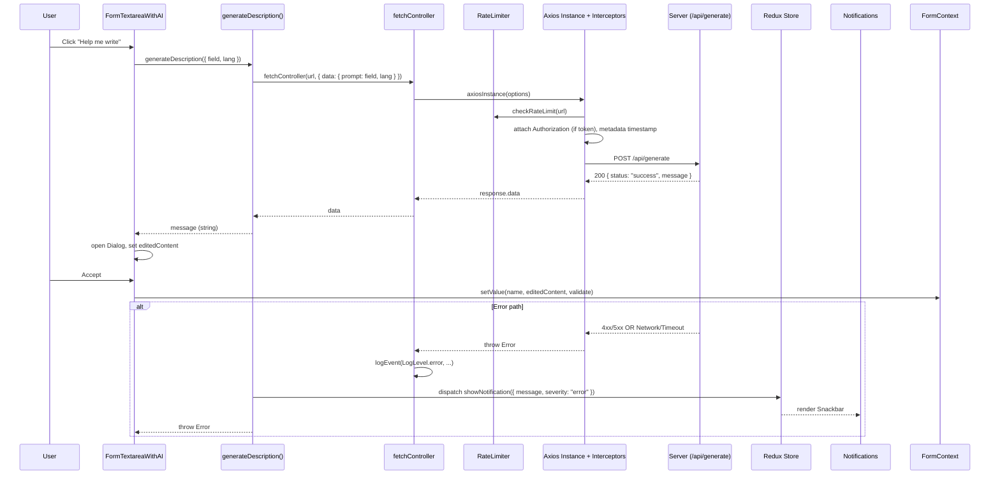
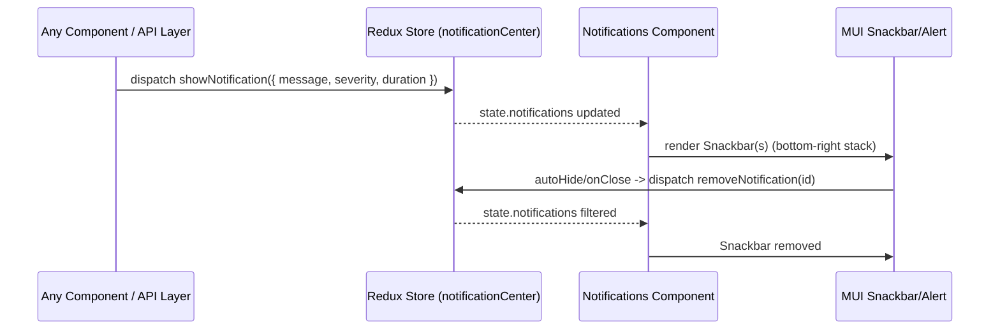

# Client Flow Diagrams (form-app-penta)

This document illustrates the key runtime flows in the client: app boot/routing, AI-assisted textarea generation, request/response handling via `fetchController`, and the notification lifecycle.

## 1) App Boot and Routing Flow

```mermaid
flowchart LR
  index[(index.html)] --> main[main.jsx]

  subgraph Providers_Stack
    styled[StyledEngineProvider]
    global[GlobalStyles "@layer theme, base, mui, components, utilities;"]
    redux[Redux Provider]
    theme[AppTheme / ThemeProvider]
    loc[LocalizationProvider (AdapterDayjs)]
    css[CssBaseline]
    router[BrowserRouter]
  end

  main --> styled --> global --> redux --> theme --> loc --> css --> router --> app[App.jsx]

  app --> routes[react-router Routes]
  routes --> layout[layouts/MainLayout.jsx]
  routes --> home[pages/Home.jsx]
  routes --> legacyForm[pages/Form.jsx]
  routes --> socialForm[pages/social-form/MainForm.jsx]
  routes --> notFound[pages/NotFound.jsx]

  %% Social form composition (simplified)
  socialForm --> stepper[Stepper + Steps]
  socialForm --> address[AddressForm.jsx]
  socialForm --> personal[components/PersonalInfoForm.jsx]
  socialForm --> family[components/FamilyFinancialInfoForm.jsx]
  socialForm --> situation[components/SituationDescriptionsForm.jsx]
  situation --> aiTextarea[components/FormTextareaWithAI.jsx]

  %% Notifications
  main --> notifComp[components/Notifications.jsx]
  notifComp --> store[store/store.js]
```

Notes:

- App.jsx also runs a language pre-select via localStorage and sets document direction before Routes render.

## 2) AI Textarea Generation (User -> API -> Store)



## 3) fetchController Interceptors and Error Handling

```mermaid
flowchart TD
  A[Request Start (fetchController)] --> B{config.url present?}
  B -- No --> R1[Reject: "Request URL is required"] --> Z[End]
  B -- Yes --> C{navigator.onLine?}
  C -- No --> R2[Reject: "No internet connection"] --> Z
  C -- Yes --> D[rateLimiter.checkRateLimit(url)]
  D --> E[Attach Authorization (localStorage.token) if present]
  E --> F[Add metadata.startTime]
  F --> G[Send via axiosInstance]

  %% Response Success
  G --> H{Response received?}
  H -- Yes --> I[duration = now - metadata.startTime]
  I --> J{duration > 5000ms?}
  J -- Yes --> K[logEvent(LogLevel.analytics, "Slow request")]
  J -- No --> L[Skip]
  K --> M{response.data present?}
  L --> M
  M -- No --> R3[Throw Error: "Empty response from server"] --> Z
  M -- Yes --> N[Return response.data] --> Z

  %% Response Error
  H -- No (error) --> E1{error.response exists?}
  E1 -- No --> E2{timeout or Network?}
  E2 -- Yes --> R4[Reject: timeout/network friendly message] --> Z
  E2 -- No --> R5[Reject: "Unable to reach server"] --> Z

  E1 -- Yes --> S1{status code}
  S1 -- 401 --> R6[Clear token; Reject: "Session expired"] --> Z
  S1 -- 429 --> R7[Reject: "Too many requests"] --> Z
  S1 -- 500+ --> R8[Reject: "Server not responding"] --> Z
  S1 -- 400 --> R9[Reject: response.data.error || "Invalid request data"] --> Z
  S1 -- other --> R10[Reject original error] --> Z
```

Notes:

- On errors, `fetchController` logs via `logEvent(LogLevel.error, ...)` and rethrows. Call sites (e.g., `generateDescription`) handle user feedback via the Redux notification slice.

## 4) Notification Lifecycle



Summary:

- User interactions drive data flow from components through an API wrapper to `fetchController`.
- Axios interceptors apply cross-cutting concerns (auth header, rate limiting, timing, logging).
- Errors are surfaced consistently via the notification system rendered by `Notifications.jsx`.
